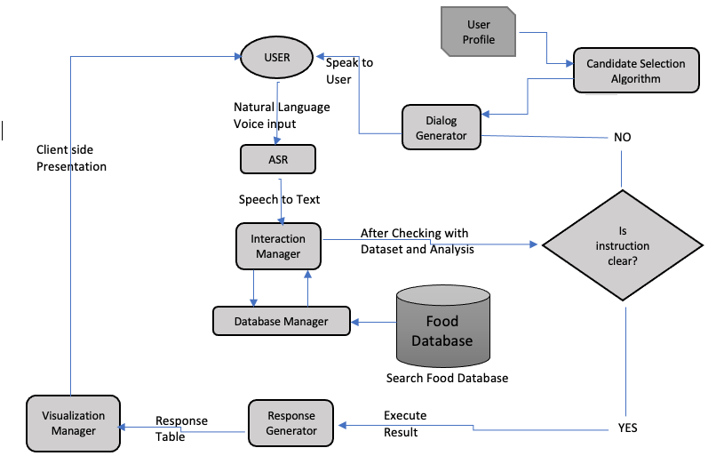

# Personal Voice Enabled Assistant to Find Food Nutritions
It is a project as a part of the CS 795(Natural Language Processing) course for Fall 2020. Here we are building a personal assistant that would help users to determine the nutrition values of their desired foods, from their casual voice command.

System Architecture:

Video demo can be found [here](https://youtu.be/tgjBPPgiLvQ)

    System usecase in a textual desciption

Let’s imagine a scenario where the user says ”I had peanut
butter and a cup of coffee for breakfast” after opening up the
system interface. To serve the speech, Nutri-Assist will carry
out the following sets of operation:
1) Convert casually spoken command of the user into text
2) Determine the food items. Here the extracted items
would be ”peanut butter” and ”coffee”.
3) Extract the given measurements of the food item and
establish the connection between them. Here, the system
finds ”a cup” is related to the ”coffee”.
4) Analyze the candidates and decide whether the instructions
are clear or more information is needed.
5
 If instructions are not clear narrate to the user to be
more specific about the choices
5) Extracted candidates are processed against a dataset
containing food names.
6) For each item prepare a tabular representation for the
user on the client-side.

#### Note to self
This is an ongoing project. Yet to implement:
- POMDP and User profile to retain previous choices and provide personalized experience
- Catching up the food measurement mentioned in the voice command.
### References
- Name entity recognition for food items: https://stackoverflow.com/questions/43909954/extracting-food-items-from-sentences/44016849
